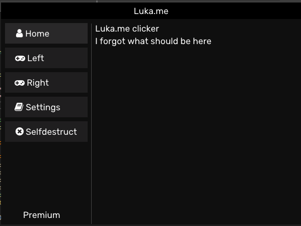
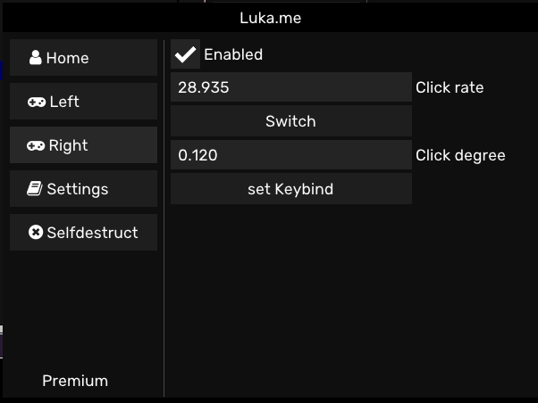
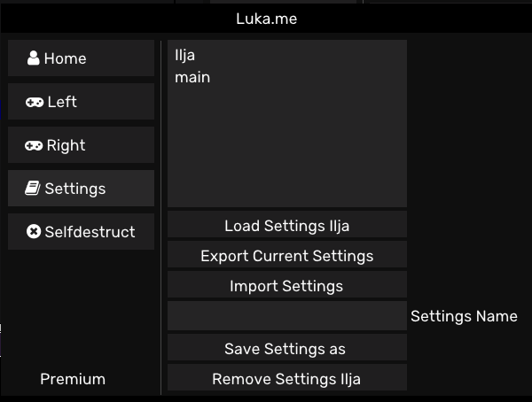

# Luka.me
A Simple C++ Autoclicker.

# How to use
Download the Clicker binary, Or you will have to download cryptopp and add it to the project(because github is gay and won't let me files), you will have to use VS22.

# Meant for Fabi.me users

# With alot of customizability

# And with savable settings

I really spend more time making this readme than making the clicker 
