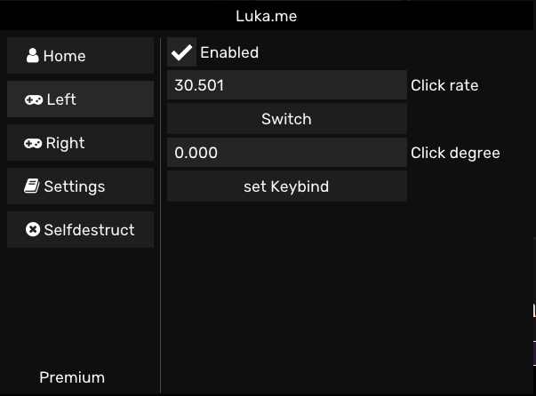

# Luka.me
A Simple C++ Autoclicker.

# How to use
Just download the source and there should be an exe file compiled somewhere,
it is also possible that you just compile it yourself. Use Visual Studio 2019 if you want to do that.

# Meant for Fabi.me users

# With alot of customizability

# And with savable settings

I really spend more time making this readme than making the clicker 
